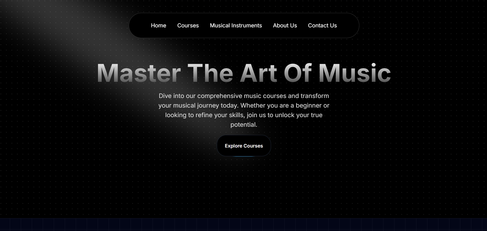

# NextJS Music App

Master the art of music with this Next.js-based landing site and UI kit. This repository contains a visually rich landing/homepage built with Next.js, TypeScript and Tailwind CSS, using a custom Aceternity-style UI (components and decorative UI primitives are included in `src/app/components/ui`). The hero banner shown above is expected to be placed as `public/hero.png` so the image appears as the README header.



## Quick overview

- Modern Next.js app (app router) and TypeScript-ready.
- Tailwind CSS for styling and layout.
- Lightweight UI primitives and animated elements in `src/app/components/ui` (3D cards, moving borders, gradients, tooltips, etc.).
- Example pages: Home, Courses, About, Contact, Webinars.

## Features

- Hero section with spotlight and CTA.
- Reusable UI components under `src/app/components` and `src/app/components/ui`.
- Pages organized under the App Router (`src/app`) for fast, server-first rendering with Next.js.
- Ready-to-edit JSON data for courses in `src/data/music_courses.json`.

## Tech stack

- Next.js 14 (app router)
- React 18
- TypeScript
- Tailwind CSS
- Framer Motion for animations

## Project structure (key files/folders)

- `public/` — static assets (put `hero.png` here so README shows the header image).
- `src/app/` — Next.js app router pages and layout (contains `page.tsx`, `layout.tsx`, and subpages like `about`, `contact`, etc.).
- `src/app/components/` — UI components used throughout the site (HeroSection, Navbar, Footer, FeaturedCourses, and a `ui/` folder with small primitives and effects).
- `src/data/` — `music_courses.json` (sample courses/data used by components).
- `src/lib/utils.ts` — small helper utilities.
- `next.config.mjs`, `tsconfig.json`, and Tailwind/PostCSS configs at repository root.

## Install & run (development)

Ensure you have Node.js 18+ (recommended for Next.js 14). From the project root:

```pwsh
npm install
npm run dev
```

Open http://localhost:3000 in your browser to view the site.

## Build & production

Build and start the production server:

```pwsh
npm run build
npm run start
```

### Available scripts (from package.json)

- `npm run dev` — Start Next.js dev server.
- `npm run build` — Build for production.
- `npm run start` — Start Next.js in production mode.
- `npm run lint` — Run Next.js/ESLint linting.

## Add the hero header image

To show the header image at the top of this README (and to use the same hero image in the app), add your hero screenshot or hero artwork to `public/hero.png`. On GitHub, that image will render at the top of the README as shown above. In the app, anything in `public/` is available at the site root (for example `/hero.png`).

## Development tips

- Components and small UI primitives live in `src/app/components/ui` — they are purposely small and easy to reuse.
- The sample course data is JSON (`src/data/music_courses.json`) — edit or extend that file to add new courses without changing code.
- Use Tailwind classes in components; the project uses `tailwind.config.ts` at the root.

## Contributing

Contributions are welcome. A good first step is to open an issue with a short description of the change you'd like to make. If you submit a PR, please include:

- Short description of the change
- Any screenshots if the change affects the UI
- Steps to reproduce/test

## License

This repo does not include an explicit license file. If you intend to make this public, add a `LICENSE` file (for example MIT) to clarify reuse rights.

## Contact

If you have project-specific questions or want help customizing the UI/hero image, open an issue or contact the repository owner.

---

Notes: The README expects `public/hero.png` to exist. If you want me to also add the image file into `public/` inside the repo (from the attached screenshot), tell me and I will add it as `public/hero.png`.
# Next.js Music App

Welcome to the Next.js Music App, a modern web application built with [Next.js](https://nextjs.org/). This project was bootstrapped with [`create-next-app`](https://github.com/vercel/next.js/tree/canary/packages/create-next-app).

## Getting Started

To get the development server up and running, execute one of the following commands in your terminal:

```bash
npm run dev
# or
yarn dev
# or
pnpm dev
# or
bun dev
```

Once the server is running, open your browser and navigate to [http://localhost:3000](http://localhost:3000) to see the application in action.

You can start making changes to the application by editing the [`app/page.tsx`](command:_github.copilot.openSymbolFromReferences?%5B%22%22%2C%5B%7B%22uri%22%3A%7B%22%24mid%22%3A1%2C%22fsPath%22%3A%22e%3A%5C%5CSKILLS%5C%5CHITESH%20SIR%20Youtube%5C%5CNextJS%20By%20Hitesh%20Sir%5C%5CNextJS%20with%20Aceternity%20UI%5C%5Cnextjs-music-app%5C%5CREADME.md%22%2C%22_sep%22%3A1%2C%22external%22%3A%22file%3A%2F%2F%2Fe%253A%2FSKILLS%2FHITESH%2520SIR%2520Youtube%2FNextJS%2520By%2520Hitesh%2520Sir%2FNextJS%2520with%2520Aceternity%2520UI%2Fnextjs-music-app%2FREADME.md%22%2C%22path%22%3A%22%2Fe%3A%2FSKILLS%2FHITESH%20SIR%20Youtube%2FNextJS%20By%20Hitesh%20Sir%2FNextJS%20with%20Aceternity%20UI%2Fnextjs-music-app%2FREADME.md%22%2C%22scheme%22%3A%22file%22%7D%2C%22pos%22%3A%7B%22line%22%3A0%2C%22character%22%3A81%7D%7D%5D%5D "Go to definition") file. The page will automatically update as you save your changes.

This project leverages [`next/font`](https://nextjs.org/docs/basic-features/font-optimization) for optimizing and loading Inter, a custom Google Font.

## Features

- **Modern UI**: Built with Next.js for fast performance and seamless user experience.
- **Font Optimization**: Uses [`next/font`](command:_github.copilot.openSymbolFromReferences?%5B%22%22%2C%5B%7B%22uri%22%3A%7B%22%24mid%22%3A1%2C%22fsPath%22%3A%22e%3A%5C%5CSKILLS%5C%5CHITESH%20SIR%20Youtube%5C%5CNextJS%20By%20Hitesh%20Sir%5C%5CNextJS%20with%20Aceternity%20UI%5C%5Cnextjs-music-app%5C%5CREADME.md%22%2C%22_sep%22%3A1%2C%22external%22%3A%22file%3A%2F%2F%2Fe%253A%2FSKILLS%2FHITESH%2520SIR%2520Youtube%2FNextJS%2520By%2520Hitesh%2520Sir%2FNextJS%2520with%2520Aceternity%2520UI%2Fnextjs-music-app%2FREADME.md%22%2C%22path%22%3A%22%2Fe%3A%2FSKILLS%2FHITESH%20SIR%20Youtube%2FNextJS%20By%20Hitesh%20Sir%2FNextJS%20with%20Aceternity%20UI%2Fnextjs-music-app%2FREADME.md%22%2C%22scheme%22%3A%22file%22%7D%2C%22pos%22%3A%7B%22line%22%3A0%2C%22character%22%3A76%7D%7D%5D%5D "Go to definition") for automatic font optimization.
- **Hot Reloading**: Edit your code and see changes in real-time without refreshing the page.

## Learn More

To dive deeper into Next.js and its capabilities, check out the following resources:

- [Next.js Documentation](https://nextjs.org/docs) - Comprehensive guide to Next.js features and API.
- [Learn Next.js](https://nextjs.org/learn) - Interactive tutorial for learning Next.js.

You can also visit the [Next.js GitHub repository](https://github.com/vercel/next.js/) to provide feedback or contribute to the project.

## Deployment

Deploying your Next.js Music App is straightforward with the [Vercel Platform](https://vercel.com/new?utm_medium=default-template&filter=next.js&utm_source=create-next-app&utm_campaign=create-next-app-readme), created by the developers of Next.js.

For detailed deployment instructions, refer to the [Next.js deployment documentation](https://nextjs.org/docs/deployment).

## Contributing

We welcome contributions to enhance the Next.js Music App. Feel free to open issues or submit pull requests on the [GitHub repository](https://github.com/your-repo/nextjs-music-app).

## License

This project is licensed under the MIT License. See the LICENSE file for more information.